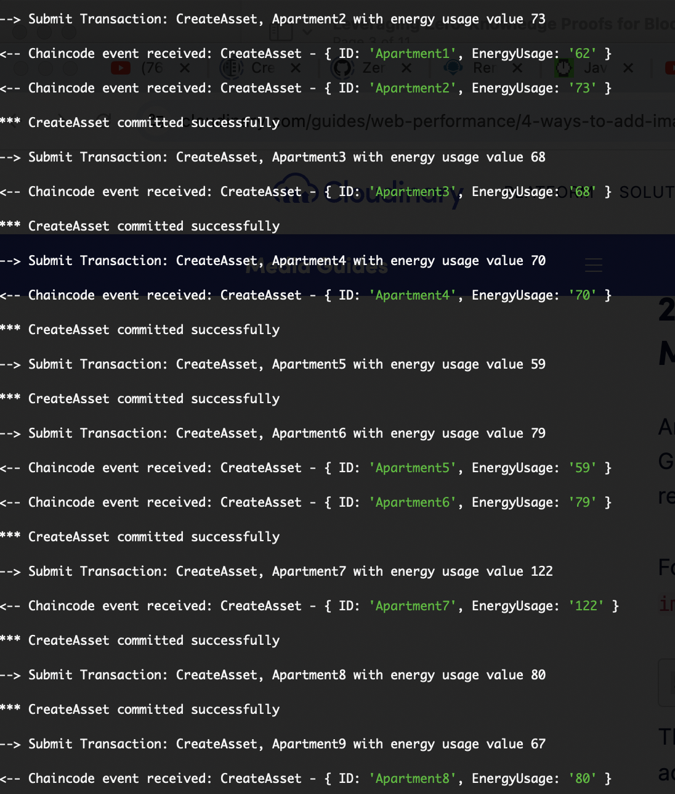

# Thesis Hyperledger Fabric ZKP and Oracle

## compile the circuit and generate test proof for Plonk protocol
./run.sh

## ZKP with SNARKJS. Create the proof, verification keys and public signals.

### install snarkjs
npm install -g snarkjs@latest

### install the module
npm install

### generate proof with nodejs
npm run prove  Multiplier2_js/Multiplier2.wasm Multiplier2_js/Multiplier2_final.zkey input.json

### verify proof with nodejs
npm run verify Multiplier2_js/verification_key.json publicSignals.json proof.json

## compile the circuit and generate test proof for Fflonk protocol
cd fflonk
./run.sh

## ZKP with SNARKJS. Create the proof, verification keys and public signals.

### install snarkjs
npm install -g snarkjs@latest

### install the module
npm install

### generate proof with nodejs
npm run prove  Multiplier3_js/Multiplier3.wasm Multiplier3_js/Multiplier3_final.zkey input.json

### verify proof with nodejs
npm run verify Multiplier3_js/verification_key.json publicSignals.json proof.json

## compile the circuit and generate test proof for Groth16 protocol
cd groth_16
./run_groth_16.sh

## ZKP with SNARKJS. Create the proof, verification keys and public signals.

### install snarkjs
npm install -g snarkjs@latest

### install the module
npm install

### generate proof with nodejs
npm run prove  Multiplier3_js/Multiplier3.wasm Multiplier3_js/Multiplier3_final.zkey input.json

### verify proof with nodejs
npm run verify Multiplier3_js/verification_key.json publicSignals.json proof.json

## HYPERLEGDGER FABRIC. Setting up the environment.
Running this prototype requires the Hyperledger Fabric application stack. 

To install it, the following prerequisits are required: 
https://hyperledger-fabric.readthedocs.io/en/latest/prereqs.html

before installing Fabric and Fabric Samples: 
https://hyperledger-fabric.readthedocs.io/en/latest/install.html

Follow the instructions for running a test-network:  
https://hyperledger-fabric.readthedocs.io/en/latest/getting_started_run_fabric.html 

### hyperledger network up from fabric-samples/test-network
After the test-network is installed and running,
cd fabric-samples/test-network
Create the channel named "mychannel" using Certificate Authorities (-ca) to generate network crypto materials
./network.sh up createChannel -c mychannel -ca

### installing snarkjs latest on _chaincode-javascript-apartment and _chaincode-javascript-energy
Go to _chaincode-javascript-apartment directory: 
cd ../asset-transfer-events/_chaincode-javascript-apartment/ 
npm install snarkjs@latest

Go to _chaincode-javascript-energy directory: 
cd ../_chaincode-javascript-energy/ 
npm install snarkjs@latest 

Go back to test-network 
cd ../../test-network 

### installing energy chaincode
From fabric-samples/test-network: 
./network.sh deployCC -ccn energy -ccp ../asset-transfer-events/_chaincode-javascript-energy  -ccl javascript -ccep "OR('Org1MSP.peer','Org2MSP.peer')"

### installing apartment chaincode
From fabric-samples/test-network: 
./network.sh deployCC -ccn apartment -ccp ../asset-transfer-events/_chaincode-javascript-apartment -ccl javascript -ccep "OR('Org1MSP.peer','Org2MSP.peer')"

### installing the prototype's triggers node applications. Create the asset apartment
Go to _application-gateway-typescript-apartment directory 
cd ../asset-transfer-events/_application-gateway-typescript-apartment 
Install and run the app 
npm install 
npm start 

### installing the prototype's triggers node applications. Create the asset apartment on the energy grid
Go to _application-gateway-typescript-energy directory 
cd ../_application-gateway-typescript-energy 
Install and run the app 
npm install 
npm start 

## The prototype explained.

### Interaction between energy and apartment smart contracts

Firstly, when running the apartment node application, n asset apartments are created and stored in the apartment chain with two attributes: ID and EnergyUsage.

These assets contain each apartment's energy usage, the power meter, to be read from the energy grid.

The energy grid smart contract creates n assets with the following attributes: ID and EnergyUsage = 0.

After the energy grid creates the assets, the UpdateAsset method reads each apartment's power meter and updates the energy grid asset.
The reading requires access to the apartment smart contract, which contains the apartment's energy usage data. This method invokes the apartment smart contract method GetEnergyUsage to fetch the asset data.
GetEnergyUsage receives the ZKP off-chain generated signals to validate the source of the requirement in-chain.
Additionally, the start and end time of the GetEnergyUsage call are taken, and both plus their differences are recorded in each block.

### Zero Knowledge Proofs sequence diagram

## IN ADDITION. The Oracle.

Finally, this prototype connects and brings data from outside the blockchain (AccuWeather API) using hyperledger fabric events.
When updating the assets from the energy-grid smart contract, the price per kWh unit is required.

To generate the price, the prototype fetches information from the AccuWeather API to determine whether it is raining.
Supposing that this is Hydroelectric-generated energy, it was arbitrarily decided that if the API answer is raining (TypeID = 1), the cost per unit (price) is 19. On the other hand, if it does not rain (TypeID = 0), the cost per unit (price) is 23.
Getting the total invoice requires calculating the energy usage times price.

### Oracle sequence diagram

## Shutting down the network.
After finishing, or if an error comes up, you can shut down the network. 

### shut down fabric
./network.sh down

### prune
docker network prune 
docker volume prune